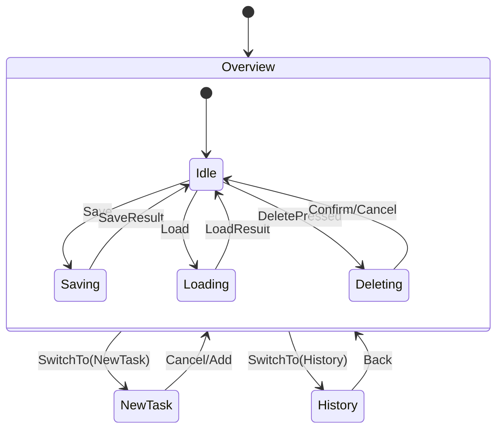
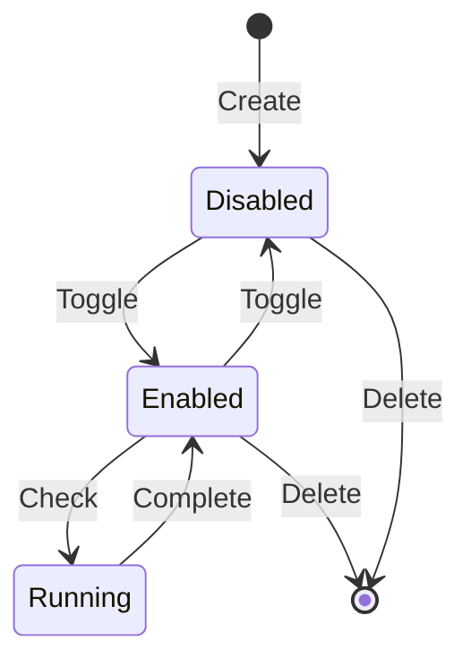
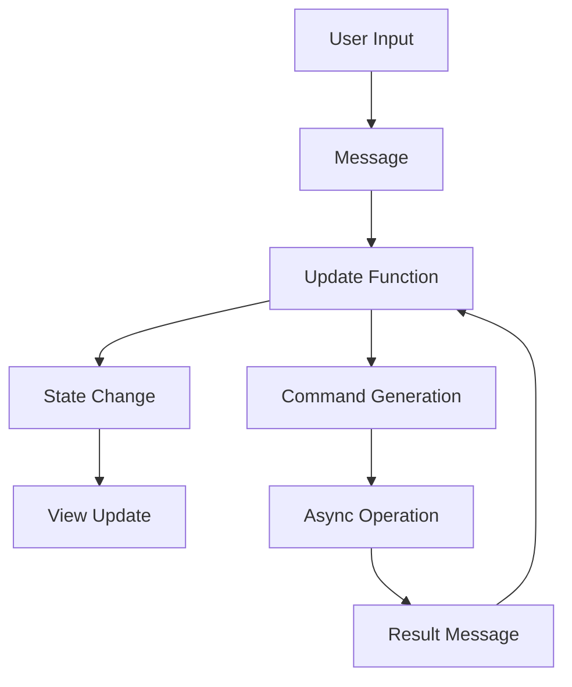

# Architecture

## Overview

The Task Scheduler is built using the Iced GUI framework for Rust, following an event-driven architecture with message passing. The application uses a Model-View-Update (MVU) pattern, similar to The Elm Architecture.

## Core Components

### Application State (`TaskScheduler`)

```rust
struct TaskScheduler {
    // Screen management
    screen: Screen,

    // Data
    tasks: Vec<Task>,

    // UI state
    task_name: String,
    interval: Interval,
    is_saving: bool,
    is_loading: bool,
    pending_delete: Option<usize>,

    // Features
    history: Vec<String>,
    toasts: Vec<(String, Instant)>,
    sort_asc: bool,
    background_running: bool,
    background_progress: f32,
    is_dark: bool,

    // System
    log_guard: Option<non_blocking::WorkerGuard>,
}
```

### Message System

Messages drive all state changes through the `update` function:

```rust
enum Message {
    // Navigation
    SwitchTo(Screen),

    // Task Management
    TaskNameChanged(String),
    IntervalChanged(Interval),
    AddTask,
    DeletePressed(usize),
    ToggleEnable(usize),

    // Operations
    Save,
    Load,
    SaveResult(Result<(), String>),
    LoadResult(Result<Vec<Task>, String>),

    // Features
    ToggleSort,
    ToggleTheme,
    ToastTick,
    StartBackground,
    BackgroundTick,

    // Input
    KeyPress { key: Key, modifiers: Modifiers },
}
```

## Key Design Patterns

### 1. Event-Driven Architecture

- All actions are messages
- State changes only through message handling
- Non-blocking operations via Commands

### 2. Immutable State Updates

- State is only modified in `update`
- All modifications create new data
- Cloning used for async operations

### 3. Subscription Pattern

- Regular tick for task checking
- Toast expiration handling
- Background task progress
- Keyboard input

## Subsystems

### 1. Persistence Layer

- JSON file storage
- Atomic writes (temp file + rename)
- Error handling with context
- Backwards compatible loading

### 2. Task Management

- Task creation/deletion
- Interval-based checking
- Enable/disable functionality
- Sorting support

### 3. UI Components

- Responsive layout
- Theme support
- Toast notifications
- Progress indicators

### 4. Logging System

- Structured JSON logging
- Rolling daily files
- Non-blocking writes
- Multiple log levels

## State Model

### Application States



### Task States



## Message Flow

### UI Events

```
User Action -> Message Generation -> State Update -> View Refresh
Example: Button Click -> Message::Save -> is_saving = true -> Show "Saving..." Status
```

### Background Operations

```
Timer Tick -> Task Check -> State Update -> Command -> Async Operation -> Result Message
Example: Minute Tick -> Check Tasks -> Find Due -> Run Task -> Update Last Run Time
```

### Data Operations

```
Save Request -> Command Generation -> Async File Write -> Result Processing -> UI Update
Example: Save -> Command::perform(save_tasks_cmd) -> Write JSON -> SaveResult -> Show Toast
```

## Data Sources

1. **Persistent Storage**

   ```
   %APPDATA%/task_scheduler_gui/
   ├── tasks.json     # Task definitions and state
   └── logs/          # Application logs
       └── task_scheduler.log
   ```

2. **Runtime State**

   - In-memory task list
   - UI state (screen, sorting, theme)
   - Transient state (toasts, background progress)

3. **System Integration**
   - File system for persistence
   - System time for intervals
   - Theme preferences
   - Keyboard events

## Error Handling Strategy

1. **Domain Error Types**

   ```rust
   // File Operations
   type FileResult<T> = Result<T, anyhow::Error>;

   // Task Operations
   type TaskResult = Result<(), String>;
   ```

2. **Error Propagation Layers**

   ```
   System Error (std::io::Error)
     │
     ├─> Domain Error (anyhow::Error + context)
     │      │
     │      ├─> UI Error (String)
     │      │      │
     │      │      ├─> Toast Notification
     │      │      └─> Status Update
     │      │
     │      └─> Log Entry (JSON structured)
     │
     └─> Fallback Behavior
   ```

3. **Recovery Strategy**

   - Atomic file operations (temp file + rename)
   - Fallback JSON parsing for backwards compatibility
   - Automatic retry on transient failures
   - Graceful degradation (e.g., console logging if file fails)

4. **Error Communication**
   - User-facing: Toast notifications, status messages
   - Developer-facing: Structured logs, error context
   - System-level: Log files with full stack traces

## Data Flow



## Error Handling

1. **UI Level**

   - Toast notifications
   - Status indicators
   - History logging

2. **Business Logic**

   - Result types
   - anyhow::Error context
   - Graceful degradation

3. **System Level**
   - Structured logging
   - File operation safety
   - Resource cleanup

## Performance Considerations

1. **Non-blocking Operations**

   - File I/O
   - Task checking
   - Progress updates

2. **Resource Management**

   - Efficient cloning
   - Controlled subscription frequency
   - Memory-conscious history

3. **UI Responsiveness**
   - Lightweight state updates
   - Efficient rendering
   - Background processing

## Security

1. **File System**

   - User directory isolation
   - Atomic writes
   - Permission checking

2. **Input Validation**
   - Task name sanitization
   - Index boundary checks
   - JSON validation

## Future Considerations

1. **Extensibility**

   - Plugin system
   - Custom intervals
   - Additional themes

2. **Scalability**

   - Database backend
   - Network sync
   - Multi-window support

3. **Integration**
   - System notifications
   - Calendar integration
   - External triggers
